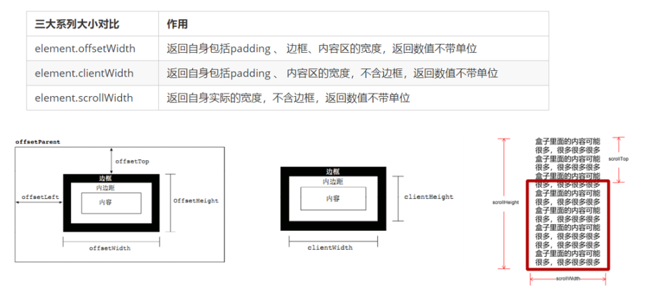

# HTML

## 1. async 和 defer 区别

- 两个都是异步加载 JS 脚本，不阻塞 html 解析
- defer 是先加载，等到 dom 解析完，在 DOMContentLoaded 事件**之前**执行脚本
- async 是加载完立即执行
- type="module"的效果等同于 defer

## href 和 src 区别

- href 用于建立当前页面与引用资源之间的关系（链接）如 a / link，
- src 则会替换当前标签，如 img / script / iframe

## meta 标签有哪些

```html
<meta charset="UTF-8" />
<meta name="keywords" content="关键词" />
<meta name="description" content="页面描述内容" />
<meta
  name="viewport"
  content="width=device-width, initial-scale=1, maximum-scale=1"
/>
```

## HTML5 新特性

- 语义化标签（对机器和开发者友好）
- canvas/svg
- localStorage / sessionStorage
- websocket
- history api
  - puhState / replaceState 方法
  - popState 事件，上述两个方法不会触发
- 拖拽/媒体/表单增强/定位相关

## DOM

### offsetHeight/scrollHeight/clientHeight 区别

- style.width 的返回值是字符串，并且带有单位
- offsetHeight/offsetWidth ：border + padding + content
- clientHeight/clientWidth ：padding + content
- scrollHeight/scrollWidth ：padding + 实际内容的尺寸
- scrollTop/scrollLeft : DOM 内部元素滚动的距离



- window.innerHeight：**可视区域高度**
- document.documentElement.clientHeight：**可视区域高度，**不包含滚动条
- document.documentElement.scrollHeight：html 元素高度
- document.body.clientHeight：body 元素高度

### getBoundingClientRect

返回 left、top、right、bottom、x、y、width 和 height 这几个以像素为单位的只读属性描述整个矩形的位置和大小。除了 width 和 height 以外的属性是相对于视图窗口的左上角来计算的。


### property 和 attribute 区别

- property：每个 DOM 节点都是 JS 对象，操作 property 是 JS 范畴的
- attribute：是 DOM 上的属性

两者之间的区别是：

- 自定义的 property 与 attribute 不同步，不相等
- 非自定义的 DOM property 与 attributes 是有条件同步的（如 value 不会同步）

### DOM 常用操作

```javascript
getElementById; // 按照 id 查询
getElementsByTagName; // 按照标签名查询
getElementsByClassName; // 按照类名查询

// 按照选择器查询
querySelector;
querySelectorAll;
```

```javascript
node.parentNode // 父级节点
parentNode.childNodes（标准）   // 子节点
parentNode.children（非标准放心使用）


node.nextSibling  // 返回当前元素的下一个兄弟元素节点，找不到则返回null。同样，也是包含所有的节点
node.previousSibling    // 可能是文本节点

node.nextElementSibling  // 返回当前元素下一个兄弟元素节点，找不到则返回null。 兼容性问题
node.previousElementSibling
```

```javascript
// 创建节点
document.createElement("tagName");

// 将一个节点添加到指定父节点的子节点列表末尾。
node.appendChild(child);

// 将一个节点添加到父节点的指定子节点前面。
node.insertBefore(child, 指定元素);

// 删除node。
node.remove();

// node.removeChild() 方法从 DOM 中删除一个子节点，返回删除的节点。
node.removeChild(child);

// 方法返回调用该方法的节点的一个副本。 也称为克隆节点/拷贝节点
node.cloneNode();
```

## 如何判断一个元素是否在可视区域中？

[http://fanyouf.gitee.io/interview/nb/03.html#%E4%B8%80%E3%80%81%E7%94%A8%E9%80%94](http://fanyouf.gitee.io/interview/nb/03.html#%E4%B8%80%E3%80%81%E7%94%A8%E9%80%94)
