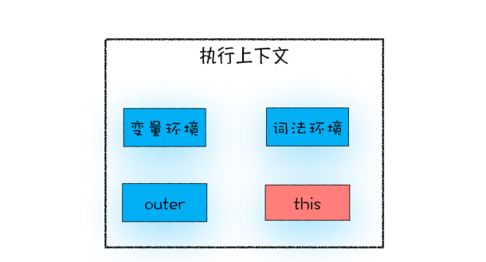
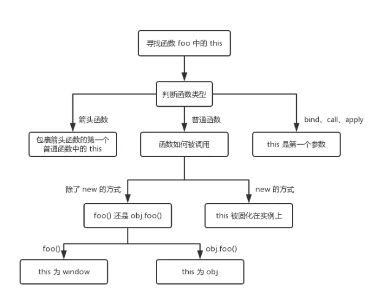
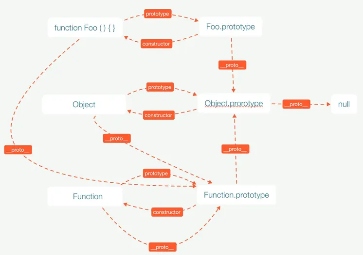
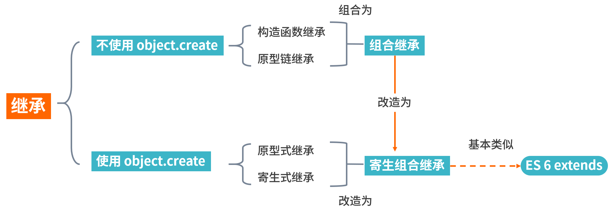

# JavaSript 基础

## 01. 数据类型判断

> 7 个基本数据类型：boolean / number / string / undefined / null / symbol / bigint(ES2020)
> 引用数据类型：object
> undefined 不是关键字，而是全局变量

**方法 1：typeof** 运算符
undefined / string / number / boolean / symbol / bigint / **function** / **object**

- 特点：可以识别 function，null 会被识别为 object [历史遗留问题](https://developer.mozilla.org/zh-CN/docs/Web/JavaScript/Reference/Operators/typeof#typeof_null)

**方法 2：instanceof** 运算符

- 特点：判断对象是否为构造函数的实例，原理是判断对象的原型链上是否存在构造函数的原型对象

```javascript
function myInstanceof(obj, Fn){
  let proto = Object.getPrototypeOf(obj) // obj.__proto__
  while(proto){
    if(proto===Fn.prototype){
      reture true
    }
    proto=Object.getPrototypeOf(proto)
  }
  return false
}
```

- isPrototypeOf 类似：

  - 判断对象是否存在于指定原型对象的原型链中
  - `Object.prototype.isPrototypeOf(obj)`

  ```js
  Object.prototype._isPrototypeOf = function (obj) {
    obj = obj.__proto__;
    while (obj) {
      if (obj === this) return true;
      obj = obj.__proto__;
    }
    return false;
  };
  ```

**方法 3：constructor**

- 原理是通过访问对象实例上的 constructor 属性对象的构造函数
- undefined 和 null 没有构造函数
- 容易伪造，不适合做类型判断
- 跨窗口下，instanceof 和 constructor 判断都会有问题

**方法 4：Object.prototype.toStrinig.call()**

- `Object.prototype.toString.call(obj).slice(8,-1)`
- 不能检测非原生构造函数的构造函数名

**总结：**

- 基本类型或者内置对象使用 `Object.prototype.toStrinig.call()`
- 自定义类型使用 instanceof

**扩展 - Object.prototype.toString 原理**

- 由于大多数对象都重写了 toString 方法，所以要使用 Object 原型上的 toString 方法
- undefined 和 null 直接返回，内置对象需要各自判断
- ES 新增的对象，都是写了`[Symbol.toStringTag]` 属性

> [Object.prototype.toString](https://tc39.es/ecma262/#sec-object.prototype.tostring)

## 02. 判断数组

- `Array.isArray(arr)`
- `Object.prototype.toString.call(arr)`
- `arr instanceof Array`
- `arr.constructor===Array`
- `Array.prototype.isPrototypeOf(arr)`

## 03.数值精度

- 在 JavaScript 中, Number 是一种 定义为 64 位双精度浮点型 (IEEE 754)的数字数据类型
- 64 位 = 1 位符号位 + 11 位指数位 + 52 位小数位

**大数精度问题**

- `Number.MIN_SAFE_INTEGER` = -(2^53-1)
- `Number.MAX_SAFE_INTEGER` = 2^53-1
- `Number.isSafeInteger()`
- 使用 ES2020 的 bigint 类型 做大数计算

**浮点数精度问题**

- 十进制的小数转为二进制时采用的方法时**乘二取整法**，可能会出现无限循环的二进制数。
- 转为整数计算，或者转为字符串计算

```js
/**
 * 精确加法
 */
function add(num1, num2) {
  const num1Digits = (num1.toString().split(".")[1] || "").length;
  const num2Digits = (num2.toString().split(".")[1] || "").length;
  const baseNum = Math.pow(10, Math.max(num1Digits, num2Digits));
  return (num1 * baseNum + num2 * baseNum) / baseNum;
}
```

- 使用类库计算如 number-precision.js、Math.js、BigDecimal.js

**相关 API**

- `numObj.toPrecision()` 四舍五入-不可靠 /`numObj.toFixed()` 返回指定小数位数
- `Math.floor()`向下取整 /` Math.ceil()`向上取整 /`Math.round()` 四舍五入

## 04. 类型转换

**隐式类型转换**

- `==`更倾向 number
- `+`更倾向转为 string
- 转为 string 时："undefined"，"null"，"true"/ "false"
- 转为 number 时：null 为 0，undefined 为 NaN，boolean 为 1/0，symbol 报错

对象会按优先级调用 `[Symbol.toPrimitive]`/ `valueof` / `toString` 方法

**强制类型转换**

- `Number()` 较严格，有非数字的字符串就会转为 NaN
- `parseInt()`
- `parseFloat()`

## 05. Object.is

使用 Object.is 来进行相等判断时，一般情况下和三等号的判断相同，它处理了一些特殊的情况，比如 -0 和 +0 不再相等，两个 NaN 是相等的。

```jsx
Object.is = function (x, y) {
  if (x === y) {
    // +0不等于-0
    return x !== 0 || 1 / x === 1 / y;
  } else {
    // 针对 NaN 等于 NaN
    return x !== x && y !== y;
  }
};
```

## 06. 变量提升

- 变量提升：是指在代码执行过程中，引擎把变量的声明部分`var`和函数的声明部分`function`提升到代码开头的 “行为”。变量被提升后，变量的值是 undefined。但实际上变量和函数声明在代码里的位置是不会改变的，而且是在预编译阶段被 JS 引擎放入内存中的，存在执行上下文的变量环境中。
- 暂时性死区：在用 let/const 命令声明变量之前，该变量都是不可用的（uninitialized）。这在语法上称为 “暂时性死区”（ temporal dead zone，简称 TDZ）

## 07. 作用域

作用域控制着变量和函数的可见性和生命周期，是声明时就决定的，是词法作用域（静态作用域）。分为：

- `全局作用域`中的对象在代码中的任何地方都能访问，其生命周期伴随着页面的生命周期。
- `函数作用域`就是在函数内部定义的变量或者函数，定义的变量或者函数只能在函数内部被访问。函数执行结束之后，函数内部定义的变量会被销毁。
- `块级作用域`就是使用一对大括号包裹的一段代码，块级作用域就是通过词法环境的栈结构来实现的。使用 let/const 使用，{ }内部变量不会覆盖外部的

## 08.作用域链

- 作用域链就是将一个个作用域串起来，实现变量查找的路径。
- 在 JavaScript 执行过程中，其作用域链是由词法作用域决定的。词法作用域就是指查找作用域的顺序是按照函数定义时的位置来决定的 ，所以词法作用域是静态的作用域。
- 每个执行上下文的变量环境中，都包含了一个外部引用，用来指向外部的执行上下文，我们把这个外部引用称为 **outer**

## 09. 闭包

- 闭包的形成源于词法作用域 和 函数可以作为值传递
- 当函数可以访问并记住所在的词法作用域时，就产生了闭包，即使函数在当前词法作用域之外执行。
- 闭包和作用域链相关，函数内部是可以读取外部作用域的变量的，但是从函数外部不可以之间读取内部的局部变量的；函数内部定义一个函数使用了局部变量并返回和被引用，这个局部变量会始终保存在内存中。
- 从 JS 引擎角度，JS 遇到内部函数，对其进行快速的词法扫描，发现内部函数引用了外部函数的变量，会在堆空间创建 closure(外部函数) 对象。
- 应用：私有化数据，缓存变量

## 10. 执行上下文

执行上下文就是当前 JavaScript 代码被解析和执行时所在环境的抽象概念。 分为：

- `全局执行上下文`
- `函数执行上下文`
- `Eval 函数执行上下文`

执行上下文栈，“调用栈”，被用来存储代码运行时创建的所有执行上下文。

变量环境是用来登记 var function 变量声明，词法环境是用来登记 let const class 等变量声明。块级作用域就是通过词法环境的栈结构来实现的，而变量提升是通过变量环境来实现。


执行上下文是代码执行之前创建的。this 的指向是执行时确定的。

## 11.this

this 是和执行上下文绑定的，每个执行上下文都有一个 this，运行时才决定 this 的指向。

1. 当函数作为对象的方法调用时，函数中的 this 就是该对象；

2. 当函数被直接调用时，在严格模式下，this 值是 undefined，非严格模式下 this 指向的是全局对象；

3. 箭头函数继承上一层作用域的 this

4. 当构造函数 new 时，this 指向新创建的对象

5. 使用 call / apply / bind 指定 this

   

**关联知识**：call / apply / bind 实现

## 12.原型和原型链

**概念**：每个对象都有属性`__proto__`指向它的构造函数的 `prototype`，原型对象也是对象也有`__proto__`，层层向上指向`Object.prototype`，最终指向`null`。当访问对象的某个属性或方法自身不存在时，会通过这个原型链层层向上找，JS 的继承就是通过原型链实现的。

**关联知识**：`new` / `instanceof` / `Object.create` 的实现和`寄生组合继承`的实现

**理解**：

- `prototype`（原型对象）是构造函数的属性，`__proto__`是任何对象的属性，指向该对象的构造函数的`prototype`。
- `prototype` 有 `constructor` 属性，指向构造函数
- 构造函数也是对象，构造函数的`__proto__`的属性指向构造函数 `Function.prototype`
- `Function.prototype`对象，其`__proto__`属性指向构造函数 `Obejct.prototype`



## 13.继承的方式（todo）



> 简单叙述，详细请看手写实现

1. 原型链继承： `Child.prototype = new Parent()`;

   缺点：所有实例对象共享一个原型对象，子类创建实例时没法传参

2. 构造函数继承：`function Child () { Parent.call(this) }`

   缺点：不能继承父类原型属性或者方法

3. 组合继承：

```javascript
function Child(name, age) {
  Parent.call(this, name); //  第二次调用 Parent()
  this.age = age;
}

Child.prototype = new Parent(); // 第一次调用 Parent()
Child.prototype.constructor = Child; // 手动挂上构造器，指向自己的构造函数
```

缺点：构造函数多调用了一次

4. 原型式继承： 基于已有的对象来创建新的对象，使用`Object.create`方法`const person = Object.create(parent)`，缺点与原型链继承相同
5. 寄生式继承：对原型式继承获得的对象，再进行扩展。缺点是没有办法实现函数的复用
6. 寄生组合式继承：

```javascript
function Child(name, age) {
  Parent.call(this, name); // 调用 Parent()
  this.age = age;
}

function inherit(Child, Parent) {
  // 这里改用 Object.create 就可以减少组合继承中多进行一次构造的过程
  Child.prototype = Object.create(Parent.prototype);
  Child.prototype.constructor = Child; // 手动挂上构造器，指向自己的构造函数
}
```

## 问题

### 问题链 1：let/const -> 作用域 -> 闭包 -> 垃圾回收

**1.1 let/const 和 var 有什么区别？**

- 概念：使用 var 声明的变量，可以在声明之前使用，其值为`undefined` 这个行为称为变量提升；ES6 提出了 let/const，在声明之前都是不可用的，成为暂时性死区。
- 解释：let/const 有着更严格的作用域规则，尽量避免使用 var。

- 引申

  - let/const 对应 **块级作用域** ，所谓作用域就是变量和函数的可访问性和生命周期。块级作用域是 ES6 新增的，在大括号内部声明 let/const 只在内部有效。
  - JS 是词法作用域，作用域是在编写代码时就决定的，还有函数作用域和全局作用域；

**1.2 说一下闭包**

- 概念：闭包的概念离不开作用域的概念，JS 是词法作用域， 函数内部可以访问外部作用域的变量。如果在一个 a 函数内部定义一个函数 b 并返回，而函数 b 引用了函数 a 的变量。此时 a 函数赋值给某个变量。从调用栈的角度讲，函数 a 执行完应该就销毁了，但引用的变量会保存在堆内存中。
- 应用：私有化数据，缓存数据
- 引申：闭包会引起内存泄漏吗
  - 使用闭包就是在利用其特性缓存数据，合理使用并不会
  - 早期 IE 使用的垃圾回收机制-引用计数算法 会造成循环引用问题，才会造成内存泄漏。

**1.3 垃圾回收机制**

- 使用标记-清除算法，通过判断对象的可达性进行清除。
- 分代回收机制：

  - 新生代：存活时间短，空间小，复制算法，晋升机制
  - 老年代：存活时间长，整理算法

- 全停顿：v8 做了一些优化，增量标记（三色标记法、利用浏览器空闲时间）

**1.4 防止内存泄漏的措施**：

- 避免使用全局变量
- 清除定时器/事件绑定/dom 引用
- 滥用闭包
- console.log 不会，打开 F12 才会引用

排查

- `Performance`：memory 折线一直上升，定位函数
- `Memory`：内存快照
