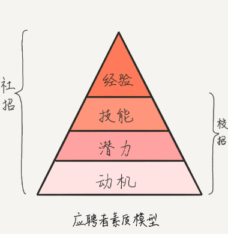
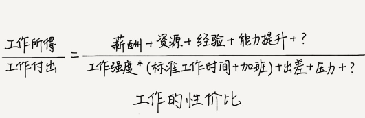
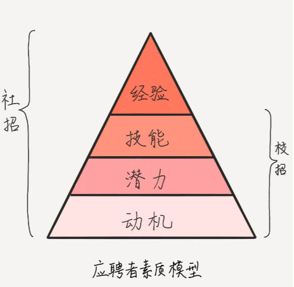
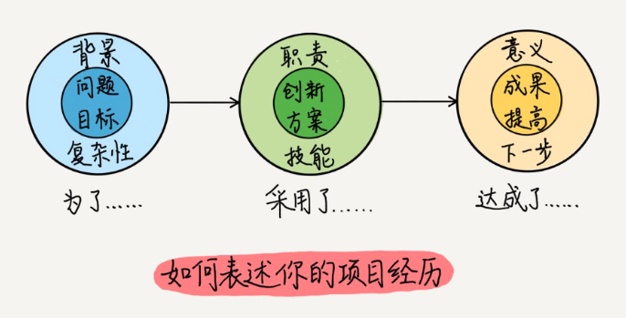
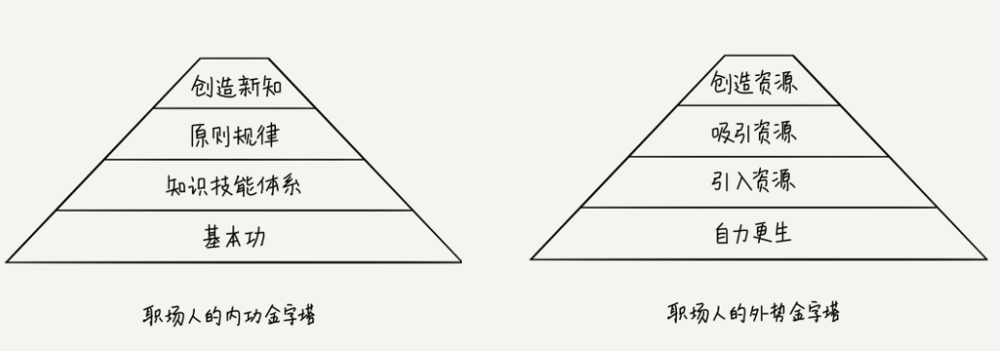

# 面试现场

> 极客时间《面试现场》的学习笔记

面试的核心，对于应聘者是想法设法让面试官认可自己对职位有用的优点。

**优点发挥得足够强，就可以弥补缺点，除非你的舞台不合适。**

面试这类**关键对话**的共同适用原则是：用真诚的态度有效地表达自己的能力和价值，建立信任和认可。

目标：看清自己的能力结构，寻找反映这些能力的素材和故事；能够分析面试问题的意图，用最有价值、有亮点的经历或观点去回答，让面试官轻而易举地看出自己的能力和价值。

## 知彼篇-公司想要什么样的人

公司眼中的好员工：

- **个人工作结果质量好，价值高**。也就是说，工作结果在特性、性能、可靠性、易用性、可维护性、安全性等等方面符合要求，而且工作结果对客户来说有用，能给客户带来价值，能够解决用户的真正问题。比如，客户想要具有拍照美颜功能的拍照 App，而你实现的 App 仅能美颜已拍好的照片，这没有满足客户的需求，对客户不产生价值。
- **赋能别人做出成果**。这又分为三个层次，一是分享精力去帮助同事工作，二是分享技能帮助同事提升技能，授人以渔，三是分享自己的视野和观念，领导他人更快更好地工作。这样的影响力，使你能带动团队成员完成更多、更复杂、更有价值的工作。

公司到底想要什么样的人呢？我们从**应聘者素质模型**可以看出：

- 动机方面，公司更想要人品好，职业价值观和团队文化一致，职业性格和职位匹配的候选人；
- 潜力方面，公司更想要学习、创新和精益能力好的候选人；
- 技能和经验方面，公司想要和职位需求匹配的，如果你资历过剩，就要看公司发展需要了，如果你资历不够，那就要看你的潜力和动机了。

可以借助这个素质模型，加上对职位描述的理解，尝试以下两点的准备和应对：

1. 了解面试官考查的各项内容和期待，做到“知彼”，**不打无准备的仗**；
2. 从个人经历中**挖掘素材**，突出契合职位需要的内容，以满足面试官的预期。

## 知彼篇-面试流程

完整的招聘全过程：从出现用人需求到需求被满足，大体会经历确定职位空缺、收集和筛选简历、面试、签 Offer、试用转正等阶段。

1. 确定职位空缺，提前预知工作的难度

   搞清楚应聘职位是补坑，还是新增，有利于你进一步评估工作难度和胜任度。

2. 了解简历收集渠道和筛选过程，有的放矢

3. 面试，是谁决定了你的去留(部门经理)

4. 签 Offer，定薪水

5. 入职试用期，你还不能放松警惕

> HR 负责快速筛选简历，组织面试，确保为职位快速找到合适的人；而部门经理才是决定你面试结果的人，也是决定这份 Offer 薪资水平的人。

## 知彼篇-面试官的面试逻辑⭐️

**面试官的目的，就是找到适合职位要求的候选人，而职位要求，最终体现在素质模型的四层当中。**

> 什么情况下，面试官会判定一个应聘者面试失败呢？
>
> 有两种情况：一、发现他不适合；二、不清楚他是否适合。
>
> **所以，应聘者需要有意识地寻找机会，向面试官展示自己的能力，而不要仅以面试官的提问为纲。**

面试官如何考察应聘者的能力 1. 观察 2. 提问 

面试过程中，按照简历和项目介绍**按图索骥**或**者随机抽样**进行提问 

作为应聘者，了解问题背后的提问意图、抓住考察的重点展现能力

面试官的问题之间是有逻辑关系的，是不同的层面的：

- **表层事实**：这层问题的回答，就要简洁精炼，不要有过多的细节，否则你会显得抓不住重点。另外，你可以用技术词汇，体现你的专业性，不用担心对方听不懂。而且，你还可以顺便扩展一下回答的范围，这有利于面试官全面地了解你。对于上面的问题，一个简单的回答可以是：“会，之前做 MySQL 开发时，写过两年的 SQL，还做过数据库调优。” 这是第一层：表层事实。

- **深度细节**：目的有两个，一是判断你的能力高低；二是判断你的潜力和动机。比如：“能说下你做过的数据库调优细节吗？”“还有什么呢？”“这个的复杂性是什么？”“你这个做法有什么创新吗？”

  这些问题的一个基本原则是：基于过去的行为（行为面试法）。你也要用经历去作答。**一般的回答，是只停留在原则上，而让人眼前一亮的回答，是会用具体事例描述细节的**。这样面试官才能了解你真正的做法、想法、质量，而不是认为你在照本宣科。

  在细节的描述上，可以使用**STAR 法则，即 Situation（情景）、Task（任务）、Action（行动）和 Result（结果）**。情境指要解决的问题和背景；任务指要承担的责任和角色；行动指方案和做法；结果指效果和意义。具体如何回答清楚技术问题，如何回答到位，我在后面的文章中会专门介绍。从这些细节中，面试官可以看出你的能力级别，还能体会到你的潜力和动机。

- **感受和观点**：这也是考查你的潜力和动机，包含事后的总结和改进有没有到位，是否具有成长型思维。比如“这段经历你感觉最折磨人的地方是什么？”“你满意这个方案么？” “你学会了什么？”“为什么你当时要接手这个任务？”“你怎么评价你的队友？”这类问题很难回答。你的回答会包含大量的价值观、性格品质等信息，如果之前没有总结过的话，你的回答可能没有深度，而且如果只是表态的内容（比如“我为了团队愿意做任何事”），没有事例去讲的话，也不会让面试官感动和信服。

> 1. 为了完成这个任务，你用到了哪些新的技能或者工具？**（表层事实**）
> 2. 你是如何用这项新技能或者工具完成任务的？**（深度细节）**
> 3. 你如何和同事合作的呢？请用一个事例说明一下。**（深度细节）**
> 4. 这个任务中，你最有成就感的地方是什么呢？**（感受和观点）**
> 5. 什么因素，是你完成这个任务的关键呢？**（感受和观点**）

## 知己篇-什么是满意的工作

**工作满意度指标**：

- 物质保障水平（考虑工作的性价比，找到平衡）
- 精神满足水平（不是舒适区，而是精神愉悦，有成就感，考虑自我实现，协作氛围等）
- 能力发展通道（决定将来的物质保障水平和精神满足水平）

这三个指标在职业生涯的不同阶段所占权重不同，分为成长期，稳定期，衰退期

**影响工作满意度的因素**：

- 可接受的薪水（职业上升期，发展机会比薪水重要）
- 合适的事
  - 做什么：产品和业务
  - 怎么做：工作过程，技术、流程和工具
- 合适的人
  - 团队：信息共享
  - 老板 ：开拓业务，打造团队，好教练，，有利于你发展的老板才是好老板

**是不是螺丝钉和公司大小无关，取决于：**

- 接触多大的工作面
- 有没有机会接触新问题和新挑战
- 多大的决定权和自由度来完成工作

## 知己篇-如何让你的简历更受青睐

面试者想要做出优秀的简历需要完成以下四点： 

- 有价值：提前收集信息，定制企业职位需求的简历 
- 易匹配：要有结构化的思维表述，经典句式："为了，，，采用了，，，达成了，，，”分别体现：定义问题，解决问题，结果反馈的能力。 
- 没硬伤：不能违背以下原则：诚信，认真，忠诚，加上注重细节 
- 有亮点：体现你超越大多数人的经历或能力，赢得面试官的加分项。

- 经验，包括专业经验、管理经验和行业经验等等。
- 技能：包括专项技术能力、管理能力、沟通表达能力、协作能力等等，不同的职位，有不同的技能要求。
- 潜力，技能提升的能力，是职位描述中可选的内容，比如“学习能力强”“有成长型思维”等。你需要通过提炼自己经历中的事例来展现这些特点和品质，并将其精炼成一句话。比如：“一个月学习 Python，率先引入 XX 框架，提高功能测试覆盖率到 70%。
- 动机，决定了做事的内因，招聘人员通过对动机的考查，来看其稳定性和工作意愿。也是职业描述中的可选内容，比如“愿意尝试新事物”,“有工作热情”等。

**简历中最重要的内容是：技能和项目经历。**

**技能**，需要按照领域分类，以列表的形式呈现在简历里。同时，要标明技能等级。等级可以用“精通”“熟练”等词标识，或者用工作年数标识。把最对口、最熟练的技能往前放。那些只是了解，还没有使用过的技能，可以不列，否则面试的时候被问到也很尴尬。

**项目经历**，体现你的工作资历和能力价值。每一段项目经历，都有其独特性，都有价值点可挖。但是，很多简历这块并没有写好。我总结出下面一种写法，如下图所示，供你参考。

一段项目经历可以用下面的结构来描述：

- 为了 < 某某问题、某某目标 >。要突出复杂性；
- 我采用了 < 某某方法、技能、流程 >。要突出创新性；
- 达成了 < 某某成果、意义 >。要突出提高。

> 举个例子。**为了**吸引读书 App 的用户成为收费会员，我们 5 人小组，用两个月的时间，做出“消费对比”功能，其中最复杂的是预测模型。**我负责**模型选型，采用了组合预测模型，**解决了**预测消费的复杂性，并且优化权度，提高了准确性，使得 App 上线后，入会人数月均增加了 60%。

## 知己篇-发现亮点⭐️

> 亮点不仅仅是表面可见的部分，要发掘到支撑这些亮点的能力素质，才是真正找到了亮点。

**如何找亮点？**

对于面试官而言，**亮点是你打动他的能力素质，以及有价值的成果**。能力素质包括经验、技能、潜力和动机，成果包括做出的产品、服务，总结的方法、实践，培养的人才和团队，以及各种形式的认可和奖励。

- 转换角度找价值：”我为谁，解决了什么问题“：公司、客户、团队、个人
- 量化结果找提高：“我在哪方面做了什么提高”
- 复盘过程找创新：“我的做法有什么与众不同”
- 回顾挑战找动机：”我解决了什么挑战“

> - 我做的这块降低了 20% 的硬件运营成本；
> - 我负责的日志监控，为 60% 的线上错误成功报警；
> - 我做的新人培训文档，使新人一周即可开展项目工作；
> - 我带头引入 Confluence 知识库工具，为团队协作和知识共享开拓了空间；
> - 我调整了小组分工，解决了工作量不均的问题；
> - 我遇到的挑战是产品安全性低，而团队又缺少这方面的经验，我的做法是……最终……

以上四个方面的分析，实际上是你深入了解工作的过程。你明确了每个项目对全局的意义，梳理了重要的工作成果以及度量指标，回顾了工作的过程和难点，以及用到的流程、工具、技能等资源，发掘了自己的工作动机。更重要的是，你仔细思考了每个工作环节为什么要这么做，能做什么提高。**这种对工作细节的把握，本身就是亮点**。只有优秀员工才会思考这些，你现在已经做到了。

**把亮点汇总到详历？**

要把亮点和相关经历融合在一起，总结成故事。每个故事可以选择下面的结构来组织：

1. 开头，“有段经历，正好遇到了这个问题……”。【问题的背景】
2. 发展，“一般的做法是做不到的，因为……”。【问题的复杂性和挑战】
3. 高潮，“我一开始用到……后来……”。【解决方案的形成过程】
4. 结局，“成果是……”。【讲结果、影响、意义】

有了这些**内含亮点的故事**，就可以构建“详历”了。

> 所谓“详历”，是相对于“简历”更详细的工作经历和能力的总结，用故事的方式，记录工作的成果、职位、经验和能力发展，相当于你的工作档案，用于回顾个人工作经历，撰写简历，也是回答面试问题的经历素材库。这些素材体现你的个人经验、技能、潜力、动机。详历是你个人工作经历的故事汇编，是你能力的索引，是给你自己参考用的，随着经历的增加而越来越充实；而简历是给面试官看的，最好因职位而异。

在详历中，你可以按照时间顺序，以项目为单元，组织故事，也可以按照能力维度来组织故事。而且，一开始构建详历时，不求一次把过去的所有经历都提炼出故事，可以重点考虑下面的经历：

- 受人瞩目的、引以为豪的成果，你是如何做到的？
- 提高和创新的部分，你是怎么做的？
- 最困难、最复杂、最有挑战的部分，你是怎么样做的？
- 从技术、业务和管理三方面，找出自己提高的地方，你是怎么提高的？

当被问到“这个项目最大的提高是什么”，或者“你失败的一次沟通是怎样的”，你可以从准备好的详历中，快速选取恰当的故事，讲给面试官。

## 问答篇-自我介绍

**自我介绍对应聘者的意义**

- **塑造第一印象**
- **暖场**。应聘者用这个过程缓解紧张，面试官用这个过程整理信息，明确面试思路。
- 第一次有机会**掌握话语的主动权**。尽量发挥好，做好铺垫，引发面试官的好感和好奇，**主动引导**接下来的问答，使之延续自我介绍中的某些话题，减少不确定性。

**面试官能从自我介绍里得到什么**

- **经历概括**，从而了解你的职业发展路径。 应聘者在这么短的时间内提及的项目、角色和职位，肯定是他觉得非常重要的，面试官接下来会重点考查。
- **经验和技能总结**，从而简单评价应聘者的经验面和技能等级。同样，对于重点提及的经验和技能，后面要考查。
- **表达风格和气场**，面试官知道自我介绍基本都是提前准备好的，这个回答体现不了多少临场的语言组织能力，但却可以看出应聘者的表达风格：是富有激情的、沉稳平静的，还是小心谨慎的？也可以感受到应聘者的气场：是张扬、自信、谦逊，还是自卑？
- **简历内容之外的信息**，比如职业规划、跳槽动机、其他亮点等。这部分的发挥，往往会起到意想不到的效果。

**面试官不想听，或者不会在意的一些自我介绍信息有下面这些**：

- 简单地重复简历上的条目；
- 自己的主观自评；
- 用口号化的语言来表白对这份工作的向往；
- 项目和技术细节（此时还没到考查细节的时候，面试官会打断你）；
- 其他与个人经历不相关的信息。

**成功的自我介绍，应该达到下面三层效果：**

- **满足面试官对信息的期待**；把个人信息、主要经历、经验和技能有条理地组织起来，有逻辑地讲出来。这考验你的逻辑表达能力。

> - “我先后在两家公司，做过 4 年业务分析师、2 年产品经理和 2 年人力经理，负责过 B2B 和 B2C 系统的业务分析和产品设计，以及 10 人团队的部门管理。因为感觉目前在公司能力提升有限，向往外企的管理文化，所以来应聘您公司的经理职位……”
>
> - “我一直在这个项目上工作了 4 年，虽然没有换项目，但是我经历了三个阶段。第一个阶段是处理 XX 模块，提高了 XX 技能；第二个阶段改为负责 XX 功能模块，提高了 XX 技能；第三个阶段，我增加了 XX 职责，做出了 XX 成果……”

- **产生好感**
  - 态度诚恳可信

  - 形成良好的互动，注意面试官的反馈，及时调整表达内容

- **记住你**：自我介绍时可以选择一两个亮点加进去。**亮点要有细节**，细节能让自我介绍更生动、更让人信服，让你令人印象深刻。

> - 我把 XX 算法开源到 GitHub 上，得到了 100 个星评”
>
> - “完成了这个挑战，不仅对高并发有了深刻的理解，还意识到自己尚有潜力可挖，实在应该感谢 XX 当初把我硬推到这个职位，我觉得要想快速提高自己，就要不怕挑战。而且，你要想到自己的成长，还要想到团队的需要。”
>
> - “本来项目进展很顺利，可突然一个核心开发提出离职。我采取了两方面的行动，才解决了问题……”

## 问答篇-回答技术问题 

一个技术领域，我们需要阐述哪些层面呢？我觉得可分两个维度，一个是技术的设计维度（从技术内部看），另一个是技术的应用维度（从技术外部看），如下图所示。

**应用维度**

- **问题**：从技术的应用维度看，首先考虑的是要解决什么问题，这是技术产生的原因。**问题这层，用来回答“干什么用”。**
- **技术规范**：可以理解为技术使用说明书，**技术规范，回答“怎么用”的问题，反映你对该技术使用方法的理解深度**。
- **最佳实践**：**最佳实践回答“怎么能用好”的问题，反映你实践经验的丰富程度**
- **市场应用趋势**：**这层回答“谁用，用在哪”的问题，反映你对技术应用领域的认识宽度。**

**设计维度**

- **目标**：为了解决用户的问题，技术本身要达成什么目标。**这层定义“做到什么”**。
- **实现原理**：为了达到设计目标，该技术采用了什么原理和机制。**实现原理层回答“怎么做到”的问题**。把实现原理弄懂，并且讲清楚，是技术人员的基本功。
- **优劣局限**：每种技术实现，都有其局限性，在某些条件下能最大化的发挥效能，缺少了某些条件则暴露出其缺陷。**优劣局限层回答“做得怎么样”的问题**。对技术优劣局限的把握，更有利于应用时总结最佳实践，是分析各种“坑”的基础。
- **演进趋势**：技术是在迭代改进和不断淘汰的。了解技术的前生后世，分清技术不变的本质，和变化的脉络，以及与其他技术的共生关系，能体现你对技术发展趋势的关注和思考。**这层体现“未来如何”**。

**确认面试官想听什么内容**

从面试官的语言和关注点上，推测他的角色、知识结构、沟通风格，回忆最近几个问题的关系，来推测问题意图。如果推测不出来，就直接问他，比如，`“我对该技术领域了解 ABCD，请问您对哪方面更感兴趣呢”`，通过这样的问题，来确定要讲的内容。这里的要点是“充分沟通”，否则你可能讲半天，对方还是不明白。自顾自地讲高深的内容，效果不一定好。

**注意表达方法**

回答提问时还应注意选用适当的表达方法，展示你的表达能力。这里，我给你一些建议。

1. **结构化表达，帮助面试官梳理信息逻辑**。比如，使用列表，或者使用结构化的语言序号“第一……第二……”。关于表达逻辑，芭芭拉 · 明托的《金字塔原理》可能会帮到你。
2. **可视化**。用画图或者演示的方法，直观形象地表达复杂的技术问题。
3. **举例子和做类比**。举常见的例子，类比成常见的事物，这样把高深的原理说简单，对方不仅能听懂，还会赞赏你的表达能力。
   比如，有人问“Java 线程和进程有什么区别”，知乎上有人回答：“如果一个大火锅一个人吃，就是单进程单线程；一个大火锅多人吃，就是单进程多线程；如果他们分开吃小火锅，就是多进程多线程了。”
   把内容说简短很不容易。马克 · 吐温曾给读者回信说：我没有时间给您写封短信，所以就写了封长信。把内容陈列出来容易，但是长话短说很难。需要你深刻理解本质，区分每块内容的重要等级，再梳理逻辑和分析取舍。
4. **对比**。电影《无双》中有一场面试，郭富城跟周润发在酒吧见面，郭富城讲作画的工艺：“……把纸放进碳酸钙和木质素就能泡出质感。行家用的油墨多数都是植物油，干得快，稳定。而我用核桃油、煤灰和松节油混合……”这里他是在把两种技术进行对比，来突出自己采用的技术有多么专业和独特。
5. **讲故事**。如果你能找到一段相关经历，讲述该技术的应用或者学习细节，展示你学以致用的能力，效果会非常好。你可以说“这个技术，我上个月正好在某某项目上用过，当时的情况是……”

选用合适的表达方法，将面试官感兴趣的部分讲出来。讲的过程中，要注意和他积极交互，根据反馈调整自己的详略和表达方式。这里，结合自己的详历，讲技术的应用细节和最佳实践，更容易满足面试官的期待。

## 问答篇-展示你在项目中的重要性 

面试官的问题往往是这样开始问的：

- “看你做的项目不少，请介绍一个你认为最能表现你能力的项目吧。”
- “XX 项目看起来挺复杂的，能否详细介绍下复杂在哪里，你的贡献又是什么？”
- “XX 项目你做的时间很长，说说你都有哪些收获吧。”

这些都是开放性问题，应聘者的回答，常常有两个主要毛病：做事浮于表面和能力单薄

**怎么才能表达出对项目的重要性呢？**

- 首先，前提是你要全面深入地了解项目，尤其是你负责的部分。这很好理解，因为如果你发挥了重要作用的话，你肯定对这部分**了如指掌**，甚至明察秋毫。
- 其次，你做出了项目**结果**。这是体现项目完成度的重要部分，是你重要性的最好证明，这是显性的。
- 最后，你**推动**了项目进展，这是隐性的。

**1.介绍项目**：

- **目标，解释为什么要做这个项目，为了什么人，解决什么问题。**
- **方案，包括业务功能设计方案和技术设计方案。**
- **团队，包括团队层级和角色。**
- **过程，即软件开发过程，是适**用**于产品方案的复杂过程。**

**2.项目结果**：

**项目结果，是指项目做到的产出，以及这些产出的质量和意义，其中属于你贡献的部分要着重讲。**

大致把项目结果分为两类

- **可见的部分**。
  （1）产品、服务、产品说明文档等；
  （2）代码、运行环境、生产线（CI/CD pipeline）；
  （3）各种过程说明性和控制性文档（需求分析、设计、代码规范、团队契约等）等实物。
- **不可见的部分**。比如，投入产出情况、项目完成质量、在线系统运行状况、各种业务数据监控指标、过程控制指标，等等。

有两个角度是面试官最关注的：做得好的和做得不好的。做得好的部分，要把做法和提高之间的因果关系说出来，以明确哪些做法要继续保持，适合在什么样情况下应用；做得不好的部分，重点展现你如何思考，有什么方法可以避免或改进。这是种反省能力，是你持续提高的动力，是面试官关注的一个重点

把可见产出和不可见的项目指标讲清楚，可以体现出你“结果导向”的做事思想。结果导向，能够让团队更明确、更高效地达成项目目标，提高项目生产力，做更有价值的产出。

**3.项目推进**：

**虽然你的项目角色是相对固定的，但是你对项目的推进作用却是可以超越角色的。**

从哪里体现自己对项目的推进作用呢？想想在项目遭遇危机和挑战的时候，大家一筹莫展，你做过什么：有没有提出过缓解或解决困难的建议，主动采取过什么行动。这些建议和行动，有可能是改善技术方面的，也可能是改善流程和团队沟通的，甚至可能是增强客户关系或争取到领导支持的。总之，如果有，即使只是一点点，也是对推进项目有意义的贡献。把这点讲出来，让面试官意识到你的影响力，判断你对项目的重要性，从而推测你在新职位、新环境里的表现。

展示你在项目中的重要性，首先，需要讲明白项目结构，包括项目目标、方案、团队和过程，这表明你对项目总体有把握，对细节有掌控；其次，要讲清项目结果，重点放在你所做的提高和不足上，提高展示你的能力和贡献，不足展现你积极思考、持续进步；再次，从项目危机和挑战中展示自己的影响力。

以上内容涉及很多项目方面，不要误会，你在讲项目的时候，没必要都讲出来，时间不允许。你的讲述可以按照面试官的面试逻辑来：先概略讲表层事实，看面试官对哪部分更感兴趣，然后再展示深度细节，最后升华成观点感受。

## 问答篇-优缺点

你认为自己最大的优点和缺点分别是什么？

特别要指出的是，**优点和缺点都是相对于具体场景和工作对象而言的，不同的职位，有不同的素质要求。**

**回答这类问题的原则**：

1. 有理有例。**（让面试官信任你的自省自知能力）**
2. 优缺点与职位匹配。**（给公司带来价值）**
3. 表述与表现匹配。**（表里如一，前后一致）**

优缺点，从哪里找呢？可以到“应聘者素质模型”的四层内容中去找：经验、技能、潜力、动机。举几个例子：

- “我在银行信贷业务方面，经验非常丰富。”**（经验层的优点）**
- “精通 Java 后端开发，但是 Web 前端开发较弱。” **（技能层的优点和缺点）**
- “入选公司接班人计划。” **（潜力层的优点实例）**
- “对新技术有好奇心，微信刚推出小程序时，两个周末搞定一个记事本小程序。”**（动机层的优点 + 实例）**

> 刚毕业那会，我负责开发一个功能模块，因为自身技术能力有限，加上时间紧，有些技术细节没有吃透，最后提交的代码质量不够好，导致功能上线延迟了一周。
>
> 后来，我仔细反思了这件事，发现根源在于自己过于自信，明明考虑得不够周到，却自满地觉得没有问题。 后来，为了避免同类事情再次发生，每次我都要先团队一起讨论实现方案，自己设计完后，都要再请团队中资深的同事帮忙检查是否有疏漏。也正是缘于我的这个做法，完善了项目的设计评审流程。
>
> 我慢慢发现一个人考虑问题的角度往往不够全面，只有集思广益才能把问题更全面的解决。通过这么多年的训练，现在的我看问题的视角越来越全面，解决问题的质量也越来越高了。当然，我知道自己做得还不够，还要继续努力查缺补漏，争取做得更好。

## 问答篇-兴趣爱好

面试官问兴趣爱好的主要意图在于：

- 推测你的动机，包括价值观、性格和特质，避免应聘者和职位、团队文化有冲突。
- 看你在没压力的状态下，能够把喜欢的事做到怎样。

兴趣爱好的一个描述结构，供你参考：

1. 兴趣爱好是什么。
2. 动机：为什么喜欢它，是喜欢过程，还是结果；
3. 过程：用什么方法，解决了什么困难，或者提高了什么能力；
4. 产出：有什么结果、收获、提高，有什么价值、影响、意义；
5. 反省：有什么感想体会，哪里可以做得更好。

在你回答面试官的问题时，没必要囊括所有这些点，把有细节、有亮点的部分讲清即可。如果有可以展现你能力的故事会更好，像下面这样：

> “我喜欢看书，尤其是人物传记类的。我可以多说两句么？……嗯，《XXX》这本书对我很有启发，我之前一直困惑的问题在这本书里找到了答案，就是……我在工作中也用到了这点，是……”

## 问答篇-回答问题要到位

在高效的面试对话中，应聘者应该能够快速找准面试官的意图，用简练精准的语言，切中要害，满足面试官的期待，从而推进对话纵深发展。

> 面试官：介绍一下你们团队吧。
>
> 应聘者：您是要了解我们团队的角色分工么？
>
> 面试官：是。
>
> 应聘者：好。我们是个 6 人团队，包括 3 个开发，2 个测试，还有国外的一个项目经理。我负责开发。我们没有专职的产品经理，项目经理只负责跟客户沟通，然后看是谁负责的模块有 UI 的改动，谁就负责界面原型设计。原来的架构师离职了，还没有招到替补的这段时间，我们几个开发会共同讨论架构这块的设计。
>
> 面试官：好的，那么……

**先弄清对方想要什么，也就是意图；再给出对方想要的。前者靠聆听，后者靠简洁精准地表达。**

**分析问题的意图**

- **题眼是什么？**
- **为什么要问这个问题？**
- **考查我的哪些能力？**

**简洁精准地表达**，回答的效果，由低到高可以有三个层次

- **最初级的效果是“贴题”**
- **更好的效果是“解题”**
- **最好的效果是“升华”**

能做到简洁精准，要求表达者**对要说的内容边界有着明确的意识**。比如，该说结果的时候，不说原因；该说事实的时候，不说评价。这样，对想表达的内容能够清楚地归类，然后根据表达需要，进行取舍，再按一定的逻辑表达出来，从而做到简洁精准。

要做到精准表达，还有几个小技巧：

- **指代清晰**。用代词要小心，如果不能让对方顺畅地理解指代的是什么，那就不要用代词。比如在文章开头的第二个例子中，“我们拿到需求做界面原型设计”，其中的“我们”是指开发人员，还是测试人员呢？这点对于面试官理解你们团队的角色分工和你个人的职责范围非常重要。
- **避开歧义**。比如，“撰写新的产品说明”，是给老产品写新的说明？还是给新的产品写说明？
- **少用不确定的语气**。否则会让对方怀疑你的自信心，进而怀疑你所说内容的准确性。
- **说出表达结构的连接词**。比如，“原因有三条，第一条……中间一条……最后一条……” 。句群之间的逻辑关系结构也要明确，比如，“这个问题的现象是……原因是……所以结论是……我们要做的就是……这样的好处是……”。这样做是为了提醒对方当前的句群属性，即使他前面走神儿没听到，也能明白当前内容与整个话题的关系。这时，你的头脑一定要清楚当前的逻辑，区分要讲的内容在句群中的逻辑位置，不能想到什么说什么，乱了逻辑。
- **结果先行**。先抛出你的核心观点，用最快的时间引起面试官的兴趣，然后再展开说过程、原因等等。否则你说了 5 分钟，还没到结论，面试官可能已经走神儿了。

能做到回答简洁精准，你就胜过一多半的竞争者了。如果再有一些独到的见解，那就更了不起了。这些见解，往往是在丰富的经验基础上，用归纳演绎法，在“5W2H”（Why - 目的、What - 用什么方法、Where - 在哪儿、When - 什么时候、Who - 谁、How much - 花费成本、How - 怎么做）的角度上得到的“有洞见”的结论。

> 面试官：……那么，是什么问题导致性能下降呢？
>
> 应聘者：是这样，当用户选择条目超过 10 条，就会有超过半分钟的数据查询时间。经过分段排除，我判断是 MySQL 数据库在产品查询时的性能问题。我要说说是怎么调优的么？
>
> 面试官：好呀。
>
> 应聘者：我先用 show log 定位到性能问题的 SQL 语句，从优化语句和数据库两方面考虑。那个 SQL 语句用了嵌套的子查询，而且里面有个大表左关联小表，我把子查询单独拿出来，另外改为用小表去左关联大表。数据库方面添加了索引。这样查询时间缩短到半秒内。
>
> 面试官：哦？为什么大表左关联小表会有问题？……

## 问答篇-被问住了怎么办

回顾面试官探索问题的三个层次：

1. **表层事实**。问题主要集中在经验和技能上，面试官在各个需要的技能领域，抽样一些典型问题，来扫描应聘者的经验面和技能面的宽度。
2. **深度细节**。问题会深入到某一项技能、经历中，问 What、How、Why，此时面试官对你的实践经历更感兴趣（而不是你的照本宣科），包括“最自豪的”“最难的”“最糟的”“最不想干的”等特例情节。面试官通过对这些细节的对比和总结，来探究你技能和思想上的深度，同时了解你的某些潜力和动机。
3. **感受和观点**。只有把知识经验提炼升华，才能形成理论层面的观点和感受。面试问题，你都应在思考中作答。比如问你对某件事情或者技术的评价，对公司发展前景的看法，这些成果有什么意义，哪里可以做得更好时，你的回答将处处展示着你的内在（思考角度、价值观、态度、性格等等），反映你的潜力和做事动机。

上面的问题又可以归为两类：

- **考验记忆的问题**，比如知识点、某件经历的细节等。记忆类问题的答案就好像存在大脑的存储器里一样，回答时，只要读取就好了。
- **考验分析的问题**，比如问最难的、最坏的、最欣赏的等等这种“最”字打头的问题，以及为什么、如何看待等问题，需要你找到相关事实，找到区别、联系，抽象出要素，运用逻辑推导，总结归纳结论。分析类问题，不仅需要你读取素材，还得经过大脑的处理加工，就好像运行程序一样，面试官需要你演示大脑运行步骤和结果。但是，如果面试官问的某一个分析类问题，你之前已经想明白了，这时候就变成记忆类问题，你只需要把之前的运行过程和结论读取出来，就好像读取过程日志和运行结果一样。

**被问住的情形和应对方法**

- **第一种，完全不知道问的是什么** 坦诚地告诉面试官自己不会
- **第二种，部分知道问的是什么。** 承认自己在这一点的水平，**变化范围和维度**（设计或应用）去回答问题

> “虽然我没用过 ConcurrentHashMap，但是我在很多项目上做过 Java 多线程编程，包括 XX、XX、XX，需要我介绍下么？” 你还可以加入限定条件，把问题转移到你所知的范围，换一个例子，比如“对于一般 Web 系统的安全性，我说不好，但是对运行在 Tomcat 上的，有几条心得，您想听么？”
>
> “虽然我不了解银行信贷业务的内部系统，但是我作为公司财务，经常跟银行打交道，对不同银行的信贷手续很了解。我可以讲出他们业务的差别和优劣来，您想听么？”

- **第三种，想不起来了**。可以按照“常识 - 做法 - 扩展”的思路来辅助回忆。
- **第四种，没想过**。

> “你觉得架构师和产品经理可以由一个人担任么”
>
> 把问题拆成“记忆类”+“分析类”两部分：**回忆**这两个角色的职责、素质和作用等等，然后**分析**它们的区别和联系，看有没有冲突，这个冲突会造成什么影响，进而判断可不可以由同一个人承担。

- **第五种，不愿说**。适当地展示一些个人细节，有利于你得到面试官的信任。

## 问答篇-如何向面试官提问

**应聘者的问题，最好是与职位相关的，并且是应聘者、面试官都关注的信息。**

一般情况下，下面的问题是比较安全的：

- **有关团队的现状和发展前景，要解决的挑战和问题等**。这类问题，一般是提给团队负责人的。这也是你了解团队的重要环节，你可以通过团队负责人的讲解，判断他的表达逻辑、沟通风格。这些问题的答案展示了团队的前景，也包含了团队负责人的领导风格，你可以判断是否能和这样的领队相处愉快。马库斯·白金汉（Marcus Buckingham）有一句名言： “员工并不想离开糟糕的公司，他们只是想离开糟糕的经理。”
- **有关项目或产品的业务、价值、技术栈、流程工具等。**
- **有关职位的工作对象、工作环境、方法工具等。**
- **该职位的考核标准、职位期望**这。类问题表明你能换位思考，从老板的角度去理解他的期望；同时也说明你是个注重实干的人，你希望了解职位的考核标准，以及所需要的各种能力；你也是个干劲十足的人，你做事结果导向，有目标感。你可以通过这个问题，确认这个职位的需求和自己的能力是否契合，以及你是否真正有意愿做这个工作。所以，在评判对方的回答时，需要重点关注老板对这个职位的期待和 KPI 的考核标准是否合理，你有没有能力达到这些标准，这些对你的成长是否有利。

注意到以上的安全范围，能使你的提问至少不减分，但是要做到加分，还得注意下面一些事项。

- **尽量展示正向的态度和观点，适当表示负面的担忧和建议**。比如：我看到这里办公空间是开放的，座位之间没有隔挡，这样能促进沟通，但是如何保证大家能不受打扰地工作呢？这个问题反映了提问者观察仔细，积极思考，能看到正向的意义，又能注意到负向的影响，寻求解决方案去消除。
- **问合适的人**。你要区分面试官的角色，是 HR，还是技术负责人，还是团队负责人。不同的角色，承担的任务不同，对职位的理解也不同。如果是技术问题，就要问技术负责人；团队发展前景的问题，就要问团队负责人。
- **问题带着自己的洞见**。比如，“对于全球团队来说，由于时区不同，往往加班沟通。您团队有这种情况么？讨教一下有没有好办法解决一下。”这个问题的确说出了跨时区团队的一个痛点，反映了提出者对全球团队的沟通有经验和思考，并且积极寻求解决方案。
- **注意情势**。前面提到，你要根据前面面试部分的自我评价，采用合适的问题弥补或者提升面试效果。如果你感觉自己的强项在前面没有考查到，可以在这时提及。
- **问题面不要太宽泛，让人抓不住你的关注点**。比如“如何做好工作？”，这个问题虽然能反映出提问者追求做好工作的动机，但是涉及面太多，不如改成：“要做好这个职位的工作，最需要具备哪些特殊的能力和素质？”
- **问题要简洁精准，不要有恭维或者冗余。**
- **问题提出去，要聆听面试官的回答，反馈你的理解，或者引出下一个问题**。这个过程要避免对抗，避免问题把对方逼到窘境。

最后， 还有一点很重要，那就是注意自己表达时的态度，态度的核心是诚恳和尊重。**好的表达状态，就像与朋友真诚地对话。彼此尊重，言辞诚恳，会促进面试双方信息的有效沟通**

## 贯通篇-精益能力

精益能力，原指企业生产中去除浪费、持续改善的能力；在劳动个体身上，来表示把工作越做越好的能力。

**寻找提高点的四种方法**：

- **梳理产品问题**。如果指标是关注用户价值，则用户提出的问题或者影响用户价值的问题优先考虑；如果指标是降低运营成本，则影响运营成本的问题优先考虑；还有性能问题、可用性问题、数据问题、基础设施问题等等。
- **识别重复动作**。如果发现一个任务被手动重复执行，那就考虑是不是可以通过自动化的方法，减少手动操作的时间。
- **识别等待**。等待是资源浪费的一种主要表现形式。精益生产的目标之一，就是减少浪费。
- **建立指标体系，找到平庸点**。可以对产品和生产过程按一定的指标进行度量，通过指标监控来发现软件质量和生产过程问题，从而进行有针对性的改进。

**如何提高**：

- **打补丁**，或许不能解决长期问题，但是对紧急问题是个短平快的解决办法。而且对于一些老旧的维持类项目，在没有更多资源投入的情况下，大改核心结构不现实，打补丁是不得已的办法。
- **翻新**，是需要勇气和投入的，建造一个新世界容易，改造一个旧世界难。对于复杂的系统，既要保证业务的正常运行，还要尽快从底层翻新成功，对技术和管理都是很大的挑战。我面试中碰到这样的项目，会如获至宝般问下去，这也是我学习的好机会。

## 贯通篇-技术领导力

领导和管理的区别：

- 领导的作用是：赋予团队目标和动力，指出更好的方向，以促成决策和推动进展。
- 管理的作用是：使计划按照既定目标和流程执行。

**用什么方法，以及在哪些方面体现你的领导力**?

- **带人或影响人**：激发他人的动机和能力

> - 你觉得培养或者指导别人时，哪方面最困难？
> - 除了技能上给他们帮助，你还做过什么？
> - 举个实例，你们团队在讨论中如何达成一致的？
> - 你培养过别人的学习能力么？
> - 如果我给你 Offer，你回去怎么做项目交接？（这个问题同时还在看其责任感。）

- **做事**：前瞻、决策、推进和担当

> 面试中，我通常会通过考查在讨论、决策、问题和危机处理等场景中应聘者的行为，来分析他的领导力：他的信息改变了讨论的基调么；他的意见左右了决策的方向么；他在问题处理中是旁观者、执行者，还是组织者；他在事件中承担了怎样的压力。

**技术领导力**:

- 扎根技术

  技术宽度包含但不限于：技术领域扩展、问题域的可选技术、全局视角、技术体系、多行业的技术应用；技术深度包含但不限于：对特定技术领域的深刻理解、前沿技术的关注、特定领域的深度技术应用。

- 着眼业务

  技术最终是要解决业务问题的，所以好的技术领导者必须着眼业务。

  这就要求我们在做技术选型时应该以此为前提，考虑投入产出比；在解决技术问题的时候，要多问为什么，搞清楚这个问题在上层看来是个什么表现，明白用户的痛点，才能解决得准。

- 懂得管理

  技术领导者也要懂得如何调动资源、统筹规划，以及如何做分工协作等管理工作，这一是为了和管理人员紧密协作，二是很多技术工作可能需要自己主持，而远远不是一个人能简单完成的了。

## 综合篇-了解团队

请珍惜和面试官的交流，尽量多了解一些关键的项目和职位信息，这些一手信息，有助于你评估和这个职位的匹配程度。这里面，**你最好了解清楚项目或产品所在的生命周期阶段**。

项目或者产品的发展，大致包含这么几个阶段：调研筹划期、投入成长期、成熟稳定期、衰退期：

综上，应聘的项目或者产品最好处于投入成长期，这时虽然工作忙碌，但是团队在发展，随着新技术新业务的引入，你的能力将得到极大的锻炼。如果是筹划期或者成熟期，需要慎重考虑，虽然衰退期也会出现一些后补空缺职位，但一般建议不要选择，当然也要视具体情况而定。

那么，如何判断一个项目或产品处于哪个生命周期阶段呢？你可以通过询问其发展历史、团队规模变化、投入和盈利情况来判断。不过，对于服务类团队，多是短期项目，可以通过了解整个团队的历史和现状，来判断发展趋势。

下面是向面试官询问项目或产品生命周期信息的一系列问题，希望你对有所启发：

- 可以说一下该项目 / 产品 / 团队的发展历史、规模、竞争力么？（这是挖掘项目、产品、团队的发展阶段）
- 该项目 / 产品 / 团队对公司的意义和作用体现在哪些方面？（这是在从公司范围评估，该项目 / 产品 / 团队的重要性）
- 该项目 / 团队的人员配置是怎样的？以及有哪些工作自主性？（这是看项目有什么角色，有什么自主权，可以发挥多大的自主性。如果业务设计、技术选型都要经过别的团队允许，那这个团队只是在做类似外包的项目，苦差事，缺少话语权和成就感）
- 该项目的技术栈、开发方法、管理流程是怎样的？（评估项目技术和管理的先进性和复杂性，进而评估自己的能力是否匹配）
- 该项目当前的主要挑战和目标是什么？（评估项目风险、发展空间，也看对自己的影响）
- 此职位当前要解决的主要问题是什么？复杂性都有哪些？（了解职位挑战和目标，根据个人能力评估匹配度，和工作强度）
- 该职位的工作包括怎样的创新性，以及怎样的操作性内容？（评估该职位的工作性质，判断与自己的创新能力、操作耐心程度是否匹配）
- 要达到什么标准才算把该职位做好？做到什么才算出色呢？公司的绩效考核标准是什么？（了解绩效标准，评估工作难度）
- 该职位需要的关键技能和等级？（看工作难度，与自己的匹配度）
- 该职位同其他的项目角色有什么协作 / 交互 / 依赖关系？（看与同事的沟通复杂度、协作挑战）
- 该职位将来的工作内容和目标会有什么变化？发展空间是什么？（了解该职位的天花板是什么，看是否与个人职业规划相符）

## 结束语

**以终为始，闭环迭代，持续提高**

**面试成功的关键，就在日常的工作里，我们其实每天都在为某一天的拐点做准备。**

> 所谓，面试不只是临时抱佛脚的事，让别人认可你的能力，不能仅靠“说”的功夫，重要的前提是能“做”。
>
> “做”是根本，把你做出的工作成果、解决问题的过程、选取方案的原则，甚至失败的尝试，能系统地总结，有条理地讲出来，改变大家的认知和做法，获得面试官的认可

## 答疑

#### 我讲不清楚东西，怎么走出单纯听别人讲的状况？

这是上个问题的延伸，也涉及逻辑分析能力。

有时候，听一个东西，我们以为自己理解了，其实只是当时大脑按照讲解者的提示，走通了，新知识并不一定和已知的知识体建立了连接，这样过后儿自己回想，可能就又糊涂了。而且，你如果要讲出来的话，得把新知识按某条逻辑组织起来，捏着某个点提起来，这其实很考验对知识的“连接”程度。所以才听懂容易，讲明白难。

想提高的话，还是得多练。比如，故事复述，给别人讲题，口述笔记……一开始讲不流利，没关系，先写出来，把节奏放慢，一边写一边思考前后怎么衔接。不妨先从百字的小段落做起，贵在坚持，三个月后再来看看效果。

## 附录-如何准备面试

面试官们的问题出发点一般是哪些呢？

根据**冰山理论**，面试官就需要通过专门的提问方式，来发掘这部分水面下的信息。

为了发掘出这部分非显性信息，最佳的提问方法当数“行为事例提问法”（Behavior-based Event Interview，简称 BEI），也就是通过对个人过去行为具体细节的深度挖掘，来预测其未来可能的行为及表现。换句话说，面试官希望听到面试者对自己过去事例的回忆和描述，然后不断就其中的一些感兴趣的细节进行提问。

面试官在做行为事例提问时，通常会遵从 **STAR 法则**，STAR 分别代表：情景（Situation）、任务（Task）、行动（Action）和结果（Result）。具体目标就是考查候选人：在什么情境下面临了什么任务，因此采取了什么行动，最后的结果如何？

因此，一个面试者如果能够在面试官提问之后，也按照 STAR 法则来回答问题，则是最符合面试官期望的。

举个例子，面试官想考查候选人的销售能力怎么样，提了一个问题：请告诉我一个你过往的事例，说一下你当时是如何帮助公司克服挑战，成功完成了一项销售任务？按照 STAR 法则，你就应该这样来组织答案：

> 在 XX 年 XX 月，当时公司面临巨大困难：市场竞争激烈，产品市场份额下降，销售人员流失严重，情景相当危急（S）。我领导了一个销售团队（T），对标并分析了市场信息，同时广泛征求了团队内部以及公司其他兄弟部门的意见，一方面加强团队的文化建设、增强凝聚力，另一方面积极开拓新的销售渠道（A）。最后既有效地稳定了团队，又实现了全年销售业绩提升 XX%，最终完成了当年的销售任务（R）。

这里需要注意的是，在回答结果（R）部分时，尽量使用**量化结果**，比如销售额实现了 XX 元、增长实现了 XX%、订单完成了 XX 个等等，这样可以让你的回答显得更加真实，也更能打动面试官。

面试官在用 STAR 法则来提问时，常见的问题有下面这些。

**（1）情景（S）**

- 这个任务 / 项目当时的背景是怎样的？
- 什么外界和内部因素导致了这样的情形？
- 当时都有哪些人员参与到这项任务 / 项目中？

**（2）任务（T）**

- 在这个项目上你的主要角色是什么？
- 你被安排的任务是什么？
- 这样安排是为了达到什么目的？

**（3）行动（A）**

- 你在这个项目中具体都做了哪些工作？
- 这个项目当时面临的最大困难或障碍是什么？你怎么解决的？
- 你还采取了哪些有效措施，确保最后的目标能顺利完成？

**（4）结果（R）**

- 这个项目最后实现的结果是什么？
- 你是用哪些指标来衡量项目成功的？
- 你从这个项目上汲取了哪些教训？如果让你重新来过，你会如何做出差别？

除了以上问题之外，我自己在做面试官时，通常会花时间来考查一下候选人在自我认知、文化价值观、发展潜力和个人业余生活方面的一些信息

**自我认知**

1. 你觉得自己的工作意义何在？把你从组织里面拿走会怎样，项目里面没有你会怎样？

2. 你领导眼中的你是什么样的？你同事眼中的你呢？如果让他们用 5 个形容词来形容你，会是什么？

3. 你觉得自己目前在工作中最需要提高的地方是什么？为什么？

**文化价值观**

1. 你最喜欢的老板是什么样的？你最不喜欢的老板是什么样的？
2. 请告诉我一个对你人生成长最有影响力的人？他帮你形成了自己的哪几个特点？
3. 你喜欢（或不喜欢）的一种公司文化是什么？
4. 当你和老板发生意见分歧的时候，你会怎么办？

**潜力**

1. 你一般是如何学习新领域的知识的？
2. 你如何看待你现在应聘的这个岗位？最近的行业发展趋势是什么？
3. 基于现有的行业变化趋势，你如何看待你所申请的这个职位未来 3 年的变化？
4. 你平时如何来开拓自己的视野和经验？如何提升自己？对于未知的未来，你具有一种什么样的心态？

**个人业务生活**

1. 你在工作之余都做什么？
2. 你最喜欢的体育运动是什么？
3. 你最近读过的一本书叫什么名字？书里你最欣赏的人物是哪个？为什么？
4. 你最喜欢的一部电影是什么？里面你最欣赏的人物是哪个？为什么？

对于任何一个问题，你需要随时做好准备，当面试官对某个细节很感兴趣的时候，他可能会打破砂锅问到底，通过 5WHY 法来不断深挖细节。因此，在准备面试时，最明智的做法是，不要为了迎合面试官而生编硬造假的案例或信息。因为一旦信息是虚构的，最后很容易在面试官的穷追猛打下漏出破绽。

我自己以前最有用的一个心得是：**先列出所有可能遇到的面试问题，然后就每个问题至少准备 2 个实际案例，提前把每个案例的细节重新回忆一遍，并用纸和笔写下来。**
